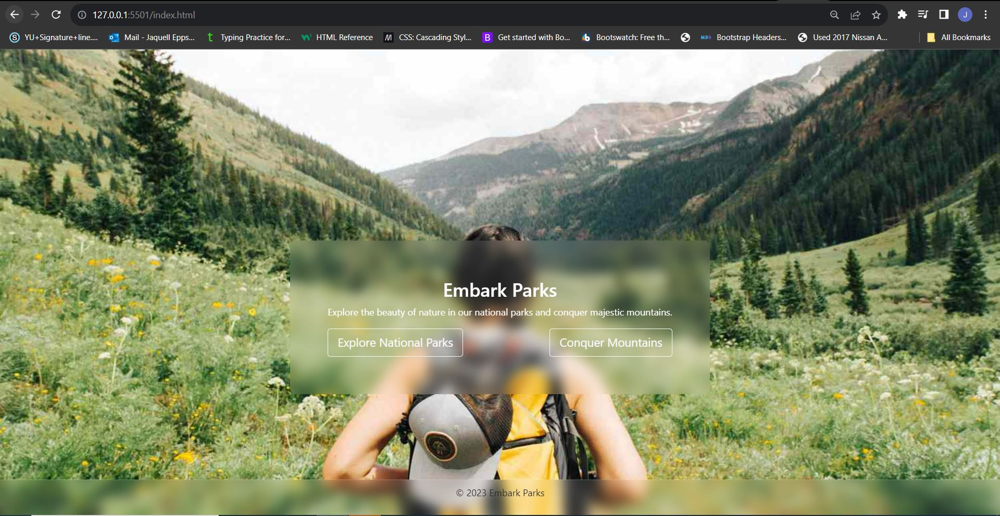
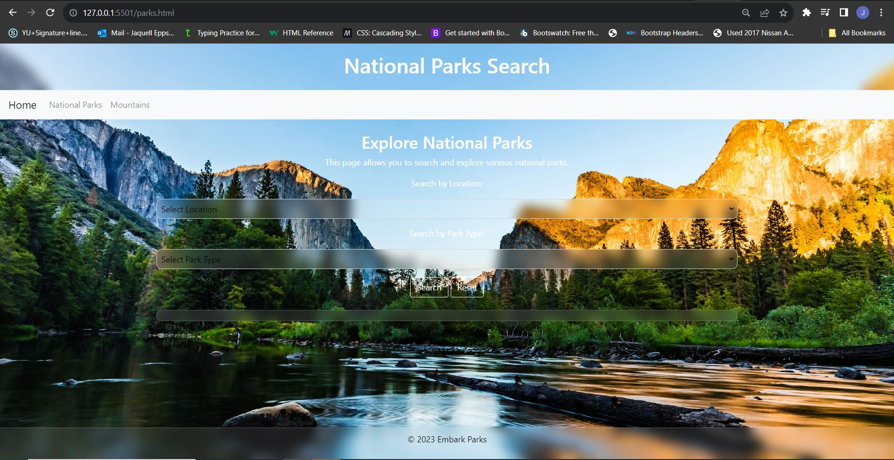
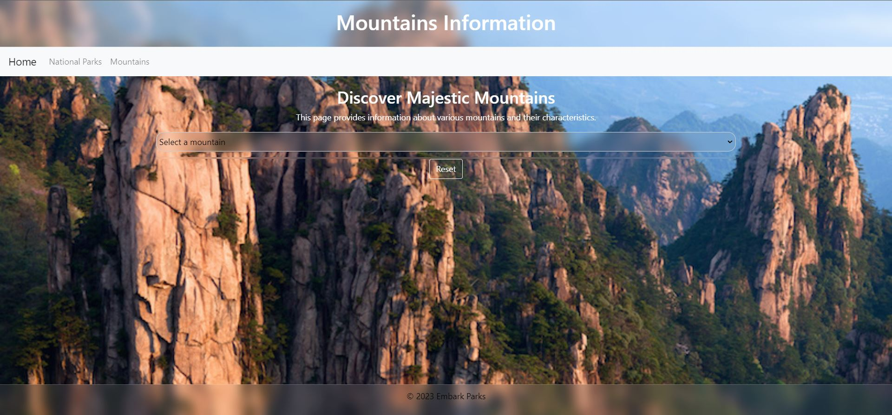
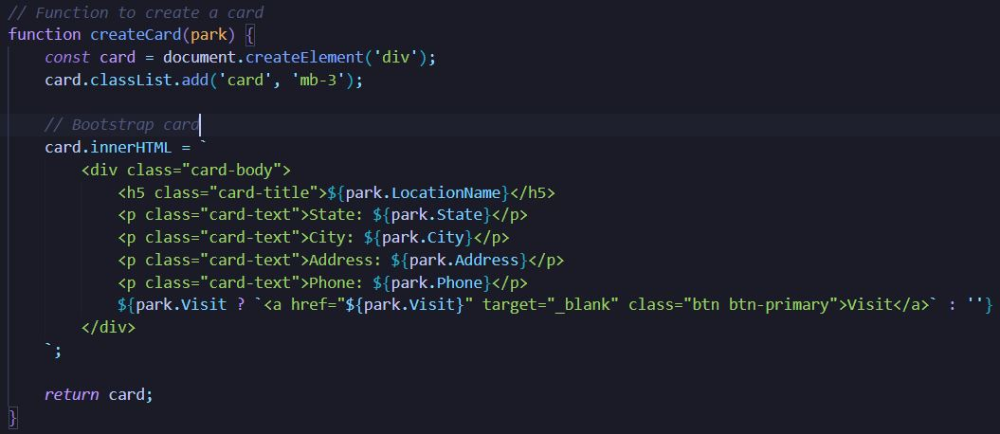

# capstone2

# Embark Parks

Embark Parks is a website that provides information about national parks and mountains, allowing users to explore details about various locations.

## Table of Contents
- [Features](#features)
- [Getting Started](#getting-started)
  - [Prerequisites](#prerequisites)
  - [Installation](#installation)
- [Usage](#usage)
- [Built With](#built-with)

## Features

- Search for national parks based on location and park type.
- Explore information about mountains and their characteristics.
- View details such as city, address, phone, and park type for national parks.

## Getting Started

### Prerequisites

- Web browser (Google Chrome, Firefox, Safari, etc.)
- Internet connection

### Installation

1. Clone the repository:
   ```bash 
   git clone https://github.com/jaquellsensi/capstone2.git
2. Navigate to the project directory: `cd capstone1`
3. Install dependencies: `npm install`

### Usage

- Open the index.html file in a web browser.
- Explore the different sections of the website, including national parks and mountains.
- Use the search functionality to find specific parks based on location and type.

### Built With

- HTML
- CSS
- JavaScript
- Bootstrap

### Home Page


### Park Page


### Mountains Page


### Interesting JavaScript

- Card display 